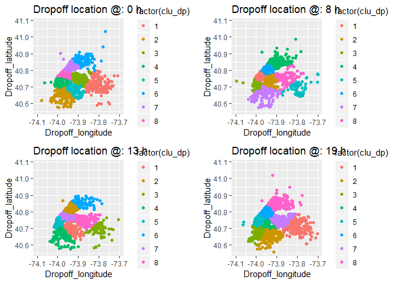
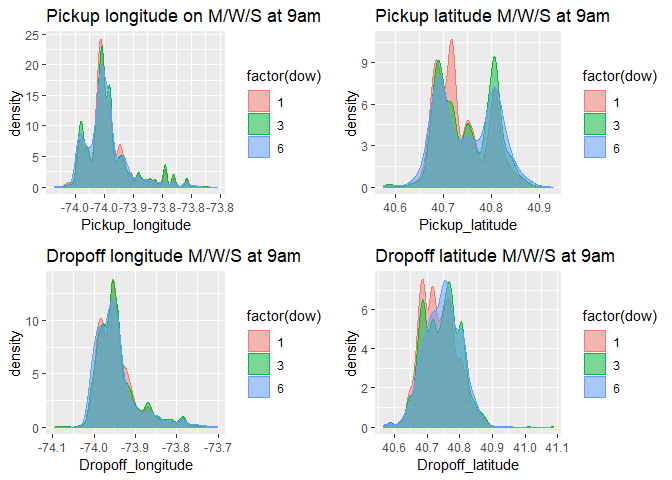

Capital One: Code Challenge
================
JC: C989704
Date: January 17, 2019

-   [Introduction](#introduction)
    -   [1.1 Data Explanation](#data-explanation)
    -   [1.2 Software preparation](#software-preparation)
-   [Question 1 - Load Data](#question-1---load-data)
-   [Question 2 - Histogram and Data Structure](#question-2---histogram-and-data-structure)
    -   [2.1 Histograms](#histograms)
    -   [2.2 Data Structures](#data-structures)
-   [Question 3 - Group behaivor](#question-3---group-behaivor)
    -   [3.1 Mean and median trip distance by hour](#mean-and-median-trip-distance-by-hour)
    -   [3.2 Airport behaivor](#airport-behaivor)
-   [Question 4 - Prediction Tip Percent](#question-4---prediction-tip-percent)
    -   [4.2 Feature selection](#feature-selection)
    -   [4.3 Deep learning model for Tip Percent prediction](#deep-learning-model-for-tip-percent-prediction)
    -   [4.2 Bayesian Additive Regression Trees model for Tip Percent prediction](#bayesian-additive-regression-trees-model-for-tip-percent-prediction)
-   [Question 5 - Anomaly Detection](#question-5---anomaly-detection)
    -   [5.1 Spatial Analysis](#spatial-analysis)
    -   [5.2 Influence of pickup hours](#influence-of-pickup-hours)
    -   [5.3 Weekday or Weekend](#weekday-or-weekend)
    -   [5.4 Holiday](#holiday)
    -   [5.5 Trip Origin](#trip-origin)
    -   [5.6 Other recommendations for anaomly detection](#other-recommendations-for-anaomly-detection)
-   [Conclusions and Future Work](#conclusions-and-future-work)

Introduction
------------

This report includes initial codes, graphs, and explanations for the Capital One Code Challenge for the Data Science Internship position. The programming language for this file is R and this report is generated using RMarkdown due to certain statistical analysis performed in this code challenge. A python version with Jupyter notebook can be processed given more flexible timing. This report mainly includes my answers to the 5 questions raised in the code challenge by Capital One and explanation to certain models using in the analysis, and unique demonstration of graphs.

Analysis and models performed in this code challenge include: Linear Regression, Discriminant Analysis, Hypothesis Testing (Shapiro-Wilk, Kruskal-Wallis Test), Principal Component Analysis, Deep Learning Neural Networks, Bayesian Additive Regression Trees (BART), and K-mean Clustering. Analysis and models considered but not yet performed due to time constraints include: Hidden Markov Model, Random Forest, Generalized Additive Model, Wavelet analysis and Autoregressive Moving Average Model (ARIMA). Google recently changes its policy on the use of API, and thus I am not able to use R to access the NYC real map for geospatial analysis. Instead, a sample code is included in this report for future geospatial analysis.

### 1.1 Data Explanation

The data being analyzed is from the NYC Taxi and Limousine trip record data (September 2015): (<http://www.nyc.gov/html/tlc/html/abount/trip_record_data.shtml>). Information about the data can be accessed at (<http://www.nyc.gov/html/tlc/downloads/pdf/data_dictionary_trip_records_green.pdf>). All the analysis performed in this report only serve for the Capital One Code Challenge for the Data Science Internship position, and may only represent the author's perspective for the code challenge.

### 1.2 Software preparation

Before we perform any analysis using the real world data, statistical packages should be loaded into the R console. If certain packages are not installed into R yet, command "install.oackages(package\_name)" should be executed.

``` r
# install.packages('ggplot2') # if package not installed
library(ggplot2) # Plotting package
library(lubridate) # Useful for time covertion and aggregate data
library(gridExtra) # Plotting package
library(ggpubr) # Plotting package
library(factoextra) # PCA plotting
library(dplyr) # Data manipulation
library(keras) # KERAS
library(bartMachine) # BART
## The following packages are for geospatial analysis
# library(tigris)
# library(dplyr)
# library(leaflet)
# library(sp)
# library(ggmap)
# library(maptools)
# library(broom)
# library(httr)
# library(rgdal)
```

Question 1 - Load Data
----------------------

If the data is not downloaded onto local computer, it can be accessed at (<https://s3.amazonaws.com/nyc-tlc/trip+data/green_tripdata_2015-09.csv>) and loaded using the same command.

After loading the data, we are able to find that there are 1494926 rows and 21 columns in the data. An "hour" command has been executed as well for further analysis.

``` r
setwd('C:/Users/Nigel/Box/Internship/CapitolOne')
df <- read.csv('green_tripdata_2015-09.csv')
# If data file is not downloaded on PC
#df1 <- read.csv('https://s3.amazonaws.com/nyc-tlc/trip+data/green_tripdata_2015-09.csv')
dim(df)
```

    ## [1] 1494926      21

``` r
print(paste('Num. of Rows:', dim(df)[1]))
```

    ## [1] "Num. of Rows: 1494926"

``` r
print(paste('Num. of Columns', dim(df)[2]))
```

    ## [1] "Num. of Columns 21"

``` r
df$pickup_hr <- hour(df$lpep_pickup_datetime)
```

Question 2 - Histogram and Data Structure
-----------------------------------------

### 2.1 Histograms

Before we provide histograms, it is useful to have some rough idea of the data. And hence different quantiles of "Trip distance" have been calculated, which will help us select the number of bins in histogram and determine the existance of outliers in the data. As we could ses, there are some extreme large values in the dataset, however only 3364 trips have distance greater than 20 miles. Thus we also provide a histogram of trip distance truncated at 20 miles.

``` r
quantile(df$Trip_distance)
```

    ##     0%    25%    50%    75%   100% 
    ##   0.00   1.10   1.98   3.74 603.10

``` r
length(which(df$Trip_distance>20))
```

    ## [1] 3364

``` r
par(mfrow = c(2, 1))
hist(df$Trip_distance, 500)
length(which(df$Trip_distance>20))
```

    ## [1] 3364

``` r
Trip_distance <- df$Trip_distance[which(df$Trip_distance<20)]
hist(Trip_distance, 100, xlab = 'Trip distance')
abline(v = mean(Trip_distance), col= 2, lwd = 2)
abline(v = median(Trip_distance), col = 4, lwd = 2)
legend('topright', legend = c('mean', 'median'), lty = 1, col = c(2, 4), cex = 0.6)
```


### 2.2 Data Structures

Through eye fitting, the trip distance variable looks log-normally distributed. The density plot shows the log-transformed trip distance is approximately normally distributed. In order to justify if trip distance can be approximately log-normally distributed, shapiro-Wilk normality test has been performed on the log-transformed data. The default shapiro.test function is only capable of taking a maximum of 5000 data, so a random sample of trip\_distance is provided to perform the hypothesis test. Through the result, we are able to determine that trip\_distance is approximately lognormally distributed (p-value &lt; 2.2e-16). A lognormal to the original histogram of trip\_distance is also attached.

``` r
hist(log(df$Trip_distance), 50, xlab = 'log-transformed trip_distance',
     probability = TRUE, main = 'Histogram of log transformed trip_distance')
lines(density(log(df$Trip_distance)), col = 2)
```


``` r
df_nonzero <- df$Trip_distance[which(df$Trip_distance!=0)]
shapiro_num <- 5
for(i in 1:shapiro_num){print(shapiro.test(df_nonzero[sample.int(length(df_nonzero), 4999)]))}
```

    ## 
    ##  Shapiro-Wilk normality test
    ## 
    ## data:  df_nonzero[sample.int(length(df_nonzero), 4999)]
    ## W = 0.8, p-value <2e-16
    ## 
    ## 
    ##  Shapiro-Wilk normality test
    ## 
    ## data:  df_nonzero[sample.int(length(df_nonzero), 4999)]
    ## W = 0.7, p-value <2e-16
    ## 
    ## 
    ##  Shapiro-Wilk normality test
    ## 
    ## data:  df_nonzero[sample.int(length(df_nonzero), 4999)]
    ## W = 0.8, p-value <2e-16
    ## 
    ## 
    ##  Shapiro-Wilk normality test
    ## 
    ## data:  df_nonzero[sample.int(length(df_nonzero), 4999)]
    ## W = 0.7, p-value <2e-16
    ## 
    ## 
    ##  Shapiro-Wilk normality test
    ## 
    ## data:  df_nonzero[sample.int(length(df_nonzero), 4999)]
    ## W = 0.7, p-value <2e-16

``` r
hist(Trip_distance, 100, xlab = 'Trip distance', probability = TRUE)
abline(v = mean(Trip_distance), col= 2, lwd = 2)
abline(v = median(Trip_distance), col = 4, lwd = 2)
df_nonzero <- df$Trip_distance[which(df$Trip_distance!=0)]
r <- range(df_nonzero)
d <- dlnorm(r[1]:r[2], meanlog = mean(log(df_nonzero)),
            sdlog = sd(log(df_nonzero)))
lines(r[1]:r[2], d, col = 'green', lwd = 3)
legend('topright', legend = c('mean', 'median', 'lognormal fit'), col = c(2, 4, 3), lty = 1, lwd = 2)
```


Question 3 - Group behaivor
---------------------------

### 3.1 Mean and median trip distance by hour

In part 3 of the analysis, we will be looking at the trip distance grouped by the hour of day (hour past midnight). Here we consider the pickup\_datetime feature as the base for determination of the hour of day. As travel time may vary owing to traffic conditions, travel distances, travel routes and other information, dropoff\_datetime is not selected for this part of analysis for simplicity. Through the figure, we are able to determine that NYC people travel at further distances at early morning between 5 AM and 8 AM or at night after 8 PM. It is likely that people tend to take the taxi to go to airports in early mornings, or try not to be late for moning shifts. The increasing trip distance after 8 PM may be related with safety issues, as certain regions of NYC has a higher criminal rate, and it may be safer to travel in taxi, which increases nightly transit distance. Another reason might be related with airport as well as people may take red-eye flights or people may taxi home from the airport around night time.

``` r
library(lubridate)
# hourly aggregated
tripDistance_median <- aggregate(Trip_distance~pickup_hr, 
                                 FUN= median, data = df)
tripDistance_mean <- aggregate(Trip_distance~pickup_hr,
                               FUN = mean, data = df)
plot(tripDistance_mean$pickup_hr, tripDistance_mean$Trip_distance, 
     type = 'b', pch = 16, col = 2, ylim = c(1.5, 4.5), xlab = 'Pickup hour', ylab = 'Trip distance')
lines(tripDistance_median$pickup_hr, tripDistance_median$Trip_distance,
      type = 'b', pch = 16, col = 4)
legend('topright', legend = c('mean', 'median'), lty = 1, col = c(2, 4))
```


### 3.2 Airport behaivor

From the data instruction, feature 'RateCodeID' represents information about pickup and dropoff locations; i.e., 'RateCodeID' = 2 or 3 indicates JFK and Newark airport respectively (in my code, Newark airport is denoted as NWJ). There is the LaGuardia airport in NYC areas, however not shown in 'RateCodeID'. One way of incorporating information towards LaGuardia airport is by making use of the longitude and latitude data, however due to GPS accuracy and difficulty in selection cut off regions of airports, LaGuardia airpot is not being considered in the following analysis.

``` r
df$duration <- difftime(df$Lpep_dropoff_datetime, df$lpep_pickup_datetime)
df$duration <- as.numeric(df$duration)
df$APT <- 1
JFK <- subset(df, df$RateCodeID == 2)
JFK$APT <- factor('JFK')
NWJ <- subset(df, df$RateCodeID == 3)
NWJ$APT <- factor('NWJ')
OTH <- subset(df, df$RateCodeID!=2 & df$RateCodeID!=3)
OTH$APT <- factor('OTH')
newdf <- rbind(JFK, NWJ, OTH)
JFK_NWJ <- rbind(JFK, NWJ)
print(paste('JFK transcation number: ', dim(JFK)[1]))
```

    ## [1] "JFK transcation number:  4435"

``` r
print(paste('NWJ transcation number: ', dim(NWJ)[1]))
```

    ## [1] "NWJ transcation number:  1117"

``` r
g1 <- ggplot(newdf, aes(x = Trip_distance, color = APT, fill = APT)) +
  geom_density(alpha = 0.5) + xlim(c(-1, 35)) +
  ggtitle('Trip distance')
g2 <- ggplot(newdf, aes(x = duration, color = APT, fill = APT)) +
  geom_density(alpha = 0.5) + xlim(c(0, 8000)) + xlab('Trip duration: seconds') + 
  ggtitle('Trip duration: s')
g3 <- ggplot(newdf[which(newdf$Fare_amount>0),], aes(x = Fare_amount, color = APT, fill = APT)) +
  geom_density(alpha = 0.5) + xlab('Fare amount') + xlim(c(0, 100)) +
  ggtitle('Fare amount')
## Pick up hours
g4 <- ggplot(JFK_NWJ, aes(x = pickup_hr, color = APT, fill = APT)) + 
  geom_density(alpha = 0.5) + 
  ggtitle('Pickup hour')
library(gridExtra)
grid.arrange(g1, g2, g3, g4, ncol = 2)
```

    ## Warning: Removed 255 rows containing non-finite values (stat_density).

    ## Warning: Removed 9075 rows containing non-finite values (stat_density).

    ## Warning: Removed 688 rows containing non-finite values (stat_density).


Here are considering three groups: JFK, NWJ and other locations. The four features being considered include trip distance, trip duration, fare amount and pick up hour (Note: pick up hour is only considered for the two airport cases). From the aggregated density plots, we could observe huge differences in the corresponding distributions of the parameters selected. Generally, for the OTH group, there is only one mode for trip distance, trip duration and fare amount, indicating most of them are happening within the local condition (no far away travels), which leads to shorter trip duration and smaller fare amount. However, on the other hand, we observe multi-modes for trip distances and trip duration for the two airports. There is a higher percentage of longer travel distances and trip durations for the two airports. JFK has a mode around 20 miles, which is roughly the distance between NYC downtown and JFK; and NWJ has smoother density with a higher density on the longer trip distances. There is not a unique difference between the pick up hours for JFK and NWJ; however both of them reach highest pick up volumes around 16 (4PM).

``` r
JFK_counts <- as.data.frame(table(JFK$pickup_hr))
NWJ_counts <- as.data.frame(table(NWJ$pickup_hr))
OTH_counts <- as.data.frame(table(OTH$pickup_hr))
OTH_ct <- OTH_counts$Freq/sum(OTH_counts$Freq)
JFK_ct <- JFK_counts$Freq/sum(JFK_counts$Freq)
NWJ_ct <- NWJ_counts$Freq/sum(NWJ_counts$Freq)

par(mfrow = c(1, 1))
plot(JFK_ct, type = 'l', xlab = 'Hours after midnight', 
     ylab = 'Normalized hourly ride count')
lines(NWJ_ct, col = 2)
lines(OTH_ct, col = 4)
legend('topleft', legend = c('JFK', 'NWJ', 'Non-airport'), col = c(1, 2, 4), lty = 1, lwd = 2)
```


``` r
JFK$pickup_hr <- hour(JFK$lpep_pickup_datetime)
NWJ$pickup_hr <- hour(NWJ$lpep_pickup_datetime)
## Average Fare
mean(JFK$Fare_amount)
```

    ## [1] 49

``` r
mean(NWJ$Fare_amount)
```

    ## [1] 48.8

``` r
JFK_Fare <- aggregate(Fare_amount~pickup_hr, 
                      FUN= mean, data = JFK)
NWJ_Fare <- aggregate(Fare_amount~pickup_hr,
                      FUN = mean, data = NWJ)

JFK_Trip <- aggregate(Trip_distance~pickup_hr, 
                      FUN= mean, data = JFK)
NWJ_Trip <- aggregate(Trip_distance~pickup_hr,
                      FUN = mean, data = NWJ)

JFK_2 <- aggregate(JFK[, c(11, 12, 22, 23)], by = list(JFK$pickup_hr), FUN = mean)
NWJ_2 <- aggregate(NWJ[, c(11, 12, 22, 23)], by = list(NWJ$pickup_hr), FUN = mean)

par(mfrow = c(1, 2))
par(mar = c(5, 5, 3, 5))
plot(JFK_Fare$pickup_hr, JFK_Fare$Fare_amount, type = 'l',
     xlab = 'Hours after midnight', ylab = 'JFK hourly average fare')
par(new = TRUE)
plot(NWJ_Fare$pickup_hr, NWJ_Fare$Fare_amount, col = 2, type = 'l',
     xaxt = 'n', yaxt = 'n', xlab = '', ylab = '', ylim = c(20, 70))
axis(side = 4, col = 2, col.axis = 2)
mtext('NWJ hourly average fare', side = 4, line = 2.8, col = 2)

par(mar = c(5, 5, 3, 5))
plot(JFK_Trip$pickup_hr, JFK_Trip$Trip_distance, type = 'l', 
     xlab = 'Hours after midnight', ylab = 'JFK hourly trip distance', lwd = 2)
par(new = TRUE)
plot(NWJ_Trip$pickup_hr, NWJ_Trip$Trip_distance, col = 2, type = 'l',
     xaxt = 'n', yaxt = 'n', xlab = '', ylab = '', lwd = 2)
axis(side = 4, col = 2, col.axis = 2)
mtext('NWJ hourly average fare', side = 4, line = 2.8, col = 2)
```


``` r
par(mar = c(5, 5, 5, 5))
plot(JFK_2$Trip_distance, JFK_2$Fare_amount, pch = 16, 
     xlab = 'JFK: Hourly average Trip distance', ylab = 'JFK:Hourly Average Fare amount')
abline(fol1 <- lm(Fare_amount~Trip_distance, data = JFK_2), col = 2, lwd = 2)
legend('bottomright', bty = 'n', legend = paste('Adj.R2:', format(summary(fol1)$adj.r.squared, digits = 2)), text.col = 2)
plot(NWJ_2$Trip_distance, NWJ_2$Fare_amount, pch = 16,
     xlab = 'NWJ: Hourly average Trip distance', ylab = 'NWJ:Hourly Average Fare amount')
abline(fol2 <- lm(Fare_amount~Trip_distance, data = NWJ_2), col = 2, lwd = 2)
legend('bottomright', bty = 'n', legend = paste('Adj.R2:', format(summary(fol2)$adj.r.squared, digits = 2)), text.col = 2)
```


``` r
plot(JFK_2$Fare_amount, JFK_2$duration, xlab = 'JFK: Hourly average Fare amount', 
     ylab = 'JFK: average trip duration [s]', pch = 16)
abline(fol3 <- lm(duration~Fare_amount, data = JFK_2), col = 2, lwd = 2)
legend('bottomright', bty = 'n', legend = paste('Adj.R2:', format(summary(fol3)$adj.r.squared, digits = 2)), text.col = 2)

plot( NWJ_2$Fare_amount, NWJ_2$duration, xlab = 'NWJ: Hourly average Fare amount',
      ylab = 'NWJ: average trip duration [s]', pch = 16)
abline(fol4 <- lm(duration~Fare_amount, data = NWJ_2), col = 2, lwd = 2)
legend('bottomright', bty = 'n', legend = paste('Adj.R2:', format(summary(fol4)$adj.r.squared, digits = 2)), text.col = 2)
```


For the airports, we observe an early morning increase ride counts since 4 am, justifying our hypothesis about early flight catch; whereas for non-airport condition, number of trips begin to increase since around 7AM, which matches morning rush hour situation.

Comparing JFK to NWJ, certain linear regression has been performed between hourly average fare amount, travel distances and travel duration. We are able to see a strong linear relation between fare and travel distance for NWJ, with adjusted R2 around 1. On the other, this linear relation is quite weak for JFK. It might be due to traffic congestion situations where fare will be higher for JFK.

Question 4 - Prediction Tip Percent
-----------------------------------

The initial dataset consists of 1494926 transcations with 21 feature time series. In order to build a final predictive model, data cleaning, selection of feature, model development and model predition will be followed. \#\#\# 4.1 Tip percent variable - Data Cleaning Derived Tip Percent variable is simply tip amount divide by total fare amount. The data clearning process includes dropping NAN values (Ehail\_fee), dropping unreasonable values, etc. In this process, we will drop any transcation that satisfy the following condition: Total fare amount &lt; 2.5 (as the minimum for NYC taxi is 2.5) Travel duration &lt; 1 min Travel speed &gt; 120 mph according to speed limit Trip distance &gt; 200 After checking the Payment\_type data, the cash option (Payment\_type == 2) has zero tips in the data, where we will neglect as no data condition. After the whole clearning process, we are leaved with 685932 data

``` r
library(plyr)
ndf <- subset(df, df$Total_amount > 2.5 & df$duration > 90) # duration should be >0
ndf$speed <- ndf$Trip_distance/ndf$duration * 3600
summary(ndf$speed)
```

    ##    Min. 1st Qu.  Median    Mean 3rd Qu.    Max. 
    ##       0       9      12      13      15    3479

``` r
ndf$Tperc <- ndf$Tip_amount/ndf$Total_amount * 100
table(ndf$Payment_type)
```

    ## 
    ##      1      2      3      4      5 
    ## 689560 761018   2460   2957     49

``` r
cash <- subset(ndf, ndf$Payment_type == 2)
cash$Tip_amount[order(cash$Tip_amount, decreasing = TRUE)][1:10]
```

    ##  [1] 13.3  0.0  0.0  0.0  0.0  0.0  0.0  0.0  0.0  0.0

``` r
ndf <- subset(ndf, ndf$Payment_type == 1)
hist(ndf$Tperc, xlab = 'Tip Percent', main = 'Histogram of Tip Percent')
```


``` r
## data frame for analysis
ndf <- ndf[, c(-1, -17, -20)] # need to reorganize this as we do not have 23 as dest anymore
## mix of categorical and continuous variable
library(lubridate)
ndf$dow <- wday(ndf$lpep_pickup_datetime) # day of week; weekday vs weekend
ndf$dom <- mday(ndf$lpep_pickup_datetime) # day of month; maybe holiday
# filter by travel distance
ndf <- subset(ndf, ndf$Trip_distance < 200)
# filter by travel duration, we do not want tour buses etc.
ndf <- subset(ndf, ndf$duration < 200*60)
# We do not want those unreasonable ones like airplane...
ndf <- subset(ndf, ndf$speed < 120)
ndf <- subset(ndf, ndf$Passenger_count>0) # should have passenger, right
dim(ndf)
```

    ## [1] 685932     25

### 4.2 Feature selection

As part of feature engineering, the following features are derived: duration; day of week; day of month; and speed. In order to justify the role of each feature on tip percent, different approaches have been considered, including hypothesis testing, linear regression etc. Features could be generally clusterd into the following categories: Time Variables: Day of Month; Day of week; Hour of day; Holiday. These variables were created under the hypothesis that people may tip different percentages based on time. For example, people may tip more on holiday and weekends compared to weekdays. Spatial Variables: Location of trip pickup and dropoff; average speed of trip; travel destination; trip type. These features were created under the hypothesis that travel destination or traffic condition may have influence over people's mode, which further drive the difference in tip percent. General Variables: passenger count; store\_and\_fwd\_flag and trip\_type. These are variables originally provided in the dataset and may contain useful information for tip percent modeling.

``` r
library(ggpubr)
par(mfrow = c(3, 1))
plot(aggregate(Tperc~dow, FUN = mean, ndf)[, 2], ylab = 'Tip percent', xlab = 'Day of week', type = 'b', pch = 16)
plot(aggregate(Tperc~dom, FUN = mean, ndf)[, 2], ylab = 'Tip percent',
     type = 'b', pch = 16)
plot(aggregate(Tperc~pickup_hr, FUN = mean, ndf)[, 2], ylab = 'Tip percent', 
     type = 'b', pch = 16)
```


``` r
g1 <- ggboxplot(ndf, x = 'dow', y = 'Tperc', 
          color = 'dow')
g2 <- ggboxplot(ndf, x = 'pickup_hr', y = 'Tperc', color = 'pickup_hr')
g3 <- ggboxplot(ndf, x = 'dom', y = 'Total_amount', color = 'dom')
grid.arrange(g1, g2, g3, ncol = 3)
```


From the figure above, day of week, day of month and pickup hour does not have an obvious control over Tip percent. The mean Tip percent only vary a little over these features, and centers around 14.1. However if we consider greater tip percent (extermers), we do see differences in the relation with tip percent amound and dom, dow, pickup hours. Four other features are also tested, where we could distinguish the impact of Travel origin or destination, passenger count, store and flag, and trip type's impact over tip percent. For example, when more passengers are on board (probably travel tour bus, or other pre-negotiated rate services), tip percent is extraodinary smaller than other trips with fewer passengers. Trip Type also has a unique influence over Tip percent, whereas street hail trips generally have higher tip percents rather than dispatch trips.

``` r
g1 <- ggboxplot(ndf, x = 'RateCodeID', y = 'Tperc', color = 'APT')
g2 <-ggboxplot(ndf, x = 'Passenger_count', y = 'Tperc', color = 'Passenger_count')
g3 <- ggboxplot(ndf, x = 'Store_and_fwd_flag', y = 'Tperc', color = 'Store_and_fwd_flag')
g4 <- ggboxplot(ndf, x = 'Trip_type', y = 'Tperc', color = 'Trip_type')
grid.arrange(g1, g2, g3, g4, ncol = 2)
```


In order to statistically determine whether these categorical features have contributed to the tip percent, Kruskal-Wallis Test has been used to determin their significance. For continuous features, such as total amount, travel distance and travel duration, a simple linear regression has been applied to determine their correlation effects. This serves as prelinminary process to select features. A principle component analysis has been applied on the continuous features to test for correlation and predictibility.

``` r
kruskal.test(Tperc~dow, data = ndf)
```

    ## 
    ##  Kruskal-Wallis rank sum test
    ## 
    ## data:  Tperc by dow
    ## Kruskal-Wallis chi-squared = 100, df = 6, p-value <2e-16

``` r
kruskal.test(Tperc~dom, data = ndf)
```

    ## 
    ##  Kruskal-Wallis rank sum test
    ## 
    ## data:  Tperc by dom
    ## Kruskal-Wallis chi-squared = 200, df = 30, p-value <2e-16

``` r
kruskal.test(Tperc~pickup_hr, data = ndf)
```

    ## 
    ##  Kruskal-Wallis rank sum test
    ## 
    ## data:  Tperc by pickup_hr
    ## Kruskal-Wallis chi-squared = 900, df = 20, p-value <2e-16

``` r
kruskal.test(Tperc~RateCodeID, data = ndf)
```

    ## 
    ##  Kruskal-Wallis rank sum test
    ## 
    ## data:  Tperc by RateCodeID
    ## Kruskal-Wallis chi-squared = 2000, df = 4, p-value <2e-16

``` r
kruskal.test(Tperc~Passenger_count, data = ndf)
```

    ## 
    ##  Kruskal-Wallis rank sum test
    ## 
    ## data:  Tperc by Passenger_count
    ## Kruskal-Wallis chi-squared = 400, df = 8, p-value <2e-16

``` r
# All significant, should incorporate all

# Test for linearity
summary(lm(Tperc~Pickup_longitude + Pickup_latitude + Dropoff_longitude + Dropoff_latitude + 
             Trip_distance + Fare_amount + Extra + MTA_tax + Tolls_amount + 
             improvement_surcharge + Total_amount + duration + speed, ndf))
```

    ## 
    ## Call:
    ## lm(formula = Tperc ~ Pickup_longitude + Pickup_latitude + Dropoff_longitude + 
    ##     Dropoff_latitude + Trip_distance + Fare_amount + Extra + 
    ##     MTA_tax + Tolls_amount + improvement_surcharge + Total_amount + 
    ##     duration + speed, data = ndf)
    ## 
    ## Residuals:
    ##    Min     1Q Median     3Q    Max 
    ## -656.5   -1.0    1.0    2.1  157.8 
    ## 
    ## Coefficients:
    ##                        Estimate Std. Error t value Pr(>|t|)    
    ## (Intercept)            1.27e+01   3.16e-01   40.40  < 2e-16 ***
    ## Pickup_longitude      -2.19e+00   7.66e-02  -28.56  < 2e-16 ***
    ## Pickup_latitude       -3.98e+00   1.39e-01  -28.61  < 2e-16 ***
    ## Dropoff_longitude     -3.00e+00   7.78e-02  -38.54  < 2e-16 ***
    ## Dropoff_latitude      -5.44e+00   1.41e-01  -38.55  < 2e-16 ***
    ## Trip_distance         -1.48e-01   6.88e-03  -21.50  < 2e-16 ***
    ## Fare_amount           -2.80e+00   3.66e-03 -763.16  < 2e-16 ***
    ## Extra                 -2.98e+00   1.66e-02 -180.13  < 2e-16 ***
    ## MTA_tax                7.87e-01   3.35e-01    2.35    0.019 *  
    ## Tolls_amount          -2.87e+00   6.79e-03 -422.79  < 2e-16 ***
    ## improvement_surcharge -3.08e+00   5.62e-01   -5.48  4.4e-08 ***
    ## Total_amount           2.49e+00   2.75e-03  903.95  < 2e-16 ***
    ## duration              -1.23e-03   2.18e-05  -56.33  < 2e-16 ***
    ## speed                 -1.33e-02   1.83e-03   -7.28  3.3e-13 ***
    ## ---
    ## Signif. codes:  0 '***' 0.001 '**' 0.01 '*' 0.05 '.' 0.1 ' ' 1
    ## 
    ## Residual standard error: 4.85 on 685918 degrees of freedom
    ## Multiple R-squared:  0.555,  Adjusted R-squared:  0.555 
    ## F-statistic: 6.57e+04 on 13 and 685918 DF,  p-value: <2e-16

``` r
res.pca <- prcomp(ndf[, c(-1, -2, -3, -4, -21)], scale = TRUE)
library(factoextra)
fviz_pca_var(res.pca,
             col.ind = "cos2", # Color by the quality of representation
             gradient.cols = c("#00AFBB", "#E7B800", "#FC4E07"),
             repel = TRUE     # Avoid text overlapping
)+labs(title = 'PCA for all features')
```


### 4.3 Deep learning model for Tip Percent prediction

As most of the derived features jointly contribute to tip percent, a deep learning neural network model has been proposed. Due to time constriants and computation constraints, deep learning models such as convolutional neural netowrks or long short term memory models are not incorporated in the model development for this code challenge. The deep learning model mainly includes three deep connected dense layers with two drop out layers for regularization purposes. Other configurations of the neural nets could be possible after tinder tunning. Dropout rate is 0.1 in the dropout layers. The activation function being used in the dense layer is "relu", mean squared error has been used for model fitting and the 'adam' optimizer is applied. We use 100000 (around 1/6) of the total data after cleaning, and 4 randomly sampled testing set of size 30000 are chosen from the data for testing purposes. The orignial choice of epochs in the model was 50, and after viusalization of model development, a number of 25 epochs are finally decided.

``` r
Tper_pred <- ndf[, c(-1, -2, -3)]
Train <- sample_n(Tper_pred, 100000)
Train_x <- Train[, -20]
Train_x_m <- as.matrix(Train_x)

Train_y <- Train[, 20]

Test <- sample_n(Tper_pred, 30000)
Test_x <- Test[, -20]
Test_x_m <- as.matrix(Test_x)
#Test_x_m <- array_reshape(x = Test_x_m, dim = list(dim(Test_x_m)[1], 1, 21))
Test_y <- Test[, 20]

library(keras)
model <- keras_model_sequential()
model %>%
  layer_dense(units = 50, activation = "relu", 
              input_shape = dim(Train_x_m)[2]) %>%
  layer_dropout(rate = 0.1) %>%
  layer_dense(units = 15) %>%
  layer_dropout(rate = 0.1) %>%
  layer_dense(units = 1) 
summary(model)
```

    ## ________________________________________________________________________________
    ## Layer (type)                        Output Shape                    Param #     
    ## ================================================================================
    ## dense_1 (Dense)                     (None, 50)                      1100        
    ## ________________________________________________________________________________
    ## dropout_1 (Dropout)                 (None, 50)                      0           
    ## ________________________________________________________________________________
    ## dense_2 (Dense)                     (None, 15)                      765         
    ## ________________________________________________________________________________
    ## dropout_2 (Dropout)                 (None, 15)                      0           
    ## ________________________________________________________________________________
    ## dense_3 (Dense)                     (None, 1)                       16          
    ## ================================================================================
    ## Total params: 1,881
    ## Trainable params: 1,881
    ## Non-trainable params: 0
    ## ________________________________________________________________________________

``` r
model %>% compile(
  loss = "mean_squared_error",
  optimizer = "adam"
)

history <- fit(
  object = model,
  x = Train_x_m,
  y = Train_y,
  batch_size = 50,
  epochs = 25,
  validation_split = 0.30
)
print(history)
```

    ## Trained on 70,000 samples, validated on 30,000 samples (batch_size=50, epochs=25)
    ## Final epoch (plot to see history):
    ## val_loss: 4.229
    ##     loss: 10.45

``` r
plot(history)
```


``` r
## To visualize prediction accuracy, I am randomly choosing subset of 
# whole data

numofPd = 4
par(mfrow = c(2, 2))
for(i in 1:numofPd){
  Vis_pd <- sample_n(Tper_pred, 100000)
  y_Vis <- Vis_pd$Tperc
  y_pd <- predict(object = model,
                  x = as.matrix(Vis_pd[, -20]))
  Vis.df <- data.frame(True = y_Vis, pd = y_pd)
  Vis.df <- subset(Vis.df, Vis.df$pd > 0 & Vis.df$pd < 100)
  plot(Vis.df$True, Vis.df$pd, pch = 16, xlab = 'True Tip Percent', 
       ylab = 'Predicted Tip Percent', main = paste('Random bag:', i, 'prediction size of 100000'))
  abline(fol <- lm(pd~True, data = Vis.df), col = 2, lwd = 2)
  legend('bottomright', bty = 'n', legend = paste('Adj.R2:', format(summary(fol)$adj.r.squared, digits = 2)), text.col = 2)
}
```


From the model results, we do achieve some promising results, with only 1/6 of the total data for training purposes, we are capable of prediction the tip percent as a function of selected features, with a promising adjusted R2 around 0.95. This significantly implied the model performance and good choice of selected features. The prediction high tip percent (&gt;80%) is less reliable compared to smaller tip percents. This is probably due to the small sample size used for training, or the inherent random noises from high tip percent. For example, it is unlikely for customers to tip large percent unless there are extreme events occurrences (such as get win a powerball, relative marriage, or other really happy things).

``` r
par(mfrow = c(2, 2))
for(i in 1:numofPd){
  Vis_pd <- sample_n(Tper_pred, 100000)
  y_Vis <- Vis_pd$Tperc
  y_pd <- predict(object = model,
                  x = as.matrix(Vis_pd[, -20]))
  Vis.df <- data.frame(True = y_Vis, pd = y_pd)
  Vis.df <- subset(Vis.df, Vis.df$pd > 0 & Vis.df$pd < 100)
  hist(Vis.df$pd - Vis.df$True, 200, xlim = c(-10, 10), probability = TRUE, xlab = 'Predicted - True', 
       main = paste('Residual plot for random sample ', i))
 
}
```


If the data is orgnaized or contains more information as longer time series, models as long short term memory could be applied to consider the inherent autocorrelation of tip percent overtime and cross-correlation of other features with tip percent over time. This can be helpful to consider impacts from longer economic situation, weather conditions, or city development. For example, with an arising economy, increasing salary for customers may lead to an increasing tip percent, which will only be shown in the data for longer time series.

For the anomalies, such as the high tip percent, a wavelet analysis might be reasonable. We are able to determine the dominant frequency of different tip percent overtime, and see the temporal distribution of the occurrence of high tip percent, from which we could utilize information such as power and frequency of wavelet, as a new feature to incorporate for high tip percent values. This could then be feeded into the deep learning model, which may further increase model prediction accuracy.

### 4.2 Bayesian Additive Regression Trees model for Tip Percent prediction

Bayesian Additive Regression Trees (BART) is a Bayesian approach to an ensemble of trees. This Bayesian "sum-of-trees" model where each tree is constrained by a regularization prior to be a weak learner, and fitting and inference are accomplished via an iterative Bayesian backfitting Markov Chain Monte Carlo simulation (MCMC) that generates samples from posterior (Chipman et al., 2008). It is a nonparametric Bayesian regresion approach which uses dimensionally adaptive random basis elements. For the tip percent prediction, BART has been used for model-free variabile selection as most of the cateogrical and contious random variable passes the Kruskal-Wallis test and the t-tests in linear regression, and it may not be reasonable for us to manually choose the most informative features, as features contributed less to tip percent may consist information useful for anomaly predictions.

As the BART inolves using iterative MCMC, with an extensive use of Gibbs sampling, we currently develop this model on a smaller random sample rather than 600000 data for timing purposes. Currently we are using 10 trees model in BART, by execuation of the command "rmse\_by\_num\_trees", we are able to determine the most appropriate number of trees in the predictive model; however not run on PC due to limiting computational power. From the error plot, we could see that prediction is also quite accurate.

``` r
library(bartMachine)
BT_tr <- Tper_pred[1:5000, -20]
BT_y <- Tper_pred[1:5000, 20]
bart <- bartMachine(BT_tr, BT_y, num_trees = 10)
```

    ## bartMachine initializing with 10 trees...
    ## bartMachine vars checked...
    ## bartMachine java init...
    ## bartMachine factors created...
    ## bartMachine before preprocess...
    ## bartMachine after preprocess... 22 total features...
    ## bartMachine sigsq estimated...
    ## bartMachine training data finalized...
    ## Now building bartMachine for regression ...
    ## evaluating in sample data...done

``` r
# rmse_by_num_trees(bart,
#                   tree_list = c(seq(3, 15, by = 3)),
#                   num_replicates = 5)

# bart <- bartMachine(BT_tr, BT_y, num_trees = 20)
plot_convergence_diagnostics(bart)
```


``` r
check_bart_error_assumptions(bart)
```

Question 5 - Anomaly Detection
------------------------------

In the last part of the code challenge, I decided to complete Option D: anomaly Detection. Anomlay detection is the identifcation of rare items, events or observations which raise suspicions by different from the majority of the data. In the NYC taxi data, its is useful for us to have a better understanding of the existance of certain anomalies in the data and how taxt traffic or behaivor from the normal case. Knowing the existance of anomalis can help us make better prediction of customer behaivors, build more reasonable behavioral model, prepare for worse scenarios, and better understanding of scoieconomic progress.

### 5.1 Spatial Analysis

In order to understand traffic behaivor, a kmean clustering has been used on the pickup and drop off location using the longitude and latitude data. From the clustering-error plot, we could see that 21 clusters might be needed to lower the within group sum of squares to less than 0.1. Due to time constraints, I am currently clustering pickup and dropoff location into 8 categories for explanation purposes. The clustering plot represents 8 groups of pickup and drop off regions at NYC by using all of the data considering no time differences. From the plot, we are able to determine traffic directions pattersn already (i.e., Manhattan Midtown to Queens)

``` r
df5 <- subset(ndf, ndf$Pickup_latitude > 40 & ndf$Pickup_longitude< -73.7 & ndf$Pickup_longitude > -74.1)
df5 <- subset(df5, df5$Dropoff_latitude > 40 & df5$Dropoff_longitude< -73.7 & df5$Dropoff_longitude > -74.1)
# data is too big for my computre, I will select a relative large subset of the data
df5 <- sample_n(df5, 100000)
set.seed(42)
k = 5:30
Withinclu_SS <- rep(0, length(k))
for(i in 1:length(k)){
  Withinclu_SS[i] <- kmeans(df5[, 5:6], k[i])$tot.withinss
}
plot(k, Withinclu_SS, type = 'b', main = 'pickup location clusters')
```


``` r
Withinclu_SS_dp <- rep(0, length(k))
for(i in 1:length(k)){
  Withinclu_SS_dp[i] <- kmeans(df5[, 7:8], k[i])$tot.withinss
}
```

    ## Warning: Quick-TRANSfer stage steps exceeded maximum (= 5000000)

``` r
plot(k, Withinclu_SS_dp, type = 'b', main = 'dropoff location clusters')
```


``` r
clusters_pk <- kmeans(df5[, 5:6], 8)
clusters_dp <- kmeans(df5[, 7:8], 8)

df5$clu_pk <- clusters_pk$cluster
df5$clu_dp <- clusters_dp$cluster
g1 <- ggplot(df5, aes(x = Pickup_longitude, y = Pickup_latitude, 
                color = factor(clu_pk))) + geom_point() + ggtitle('Pickup location')
g2 <- ggplot(df5, aes(x = Dropoff_longitude, y = Dropoff_latitude, 
                color = factor(clu_dp))) + geom_point() + ggtitle('Dropoff location')
grid.arrange(g1, g2, ncol = 2)
```


### 5.2 Influence of pickup hours

Pickup hours have huge influence over the location that passengers are being picked up or dropped off. We currently selected 4 pick up hours as reference: 8am for early morning rush hour; 1 pm for early afternoon lunch break; 7pm for off work schedule; and midnight for late night purposes. From the clustering plot, we could see the propotion of the 8 clusters change over different time, which indicates there are specific travel patterns distinguished based on travel time. For example, Manhattan finacial center regions do not experience high volume of pick up during morning rush hours, however reach higher volume during drop off hours. This cluster plot uniquely shows the travel pattern of passengers over time.

``` r
pk_hr <- c(0, 8, 13, 19)
plots_pk <- list()
plots_dp <- list()
for(i in 1:length(pk_hr)){
  df_sub <- subset(df5, df5$pickup_hr == pk_hr[i])
  df_sub$clu_pk <- kmeans(df_sub[, 5:6], 8)$cluster
  df_sub$clu_dp <- kmeans(df_sub[, 7:8], 8)$cluster
  plots_pk[[i]] <- ggplot(df_sub, aes(x = Pickup_longitude, y = Pickup_latitude, 
                        color = factor(clu_pk))) + geom_point() + 
    xlim(c(min(df5$Pickup_longitude), max(df5$Pickup_longitude))) + 
    ylim(c(min(df5$Pickup_latitude), max(df5$Pickup_latitude))) + 
    ggtitle(paste('Pickup location @:', pk_hr[i], 'h')) +
    theme(legend.title = element_blank())
  plots_dp[[i]] <- ggplot(df_sub, aes(x = Dropoff_longitude, y = Dropoff_latitude, 
                        color = factor(clu_dp))) + geom_point() + 
    xlim(c(min(df5$Dropoff_longitude), max(df5$Dropoff_longitude))) + 
    ylim(c(min(df5$Dropoff_latitude), max(df5$Dropoff_latitude))) + 
    ggtitle(paste('Dropoff location @:', pk_hr[i], 'h'))
}

grid.arrange(plots_pk[[1]], plots_pk[[2]], plots_pk[[3]], plots_pk[[4]], ncol = 2)
```


``` r
grid.arrange(plots_dp[[1]], plots_dp[[2]], plots_dp[[3]], plots_dp[[4]], ncol = 2)
```



Further, we could observe directly from the aggregated density figure below that passengers getting picked up have unique temporal dependence. For exmaple, (40.73, -73.95) has maximum pick up around midnight, however none of the other time periods have shown this behaivor. Indicating this region may be related with airport, where after midnight there will be more passengers chosing to travel via taxi instead of public transport at day time or early night time hours. There are also unique features showinthe dropoff latitude based on different hours. We could observe high volume of dropoff at a latitude of 40.78 to 40.82 at 8am, indicating this is specific working regions, where people travel for work. However, for 0am or 7pm, the drop off latitude shifts towards smaller values (~40.7) indicating those are regions with households.

``` r
sub <- subset(df5, df5$pickup_hr == 0 | df5$pickup_hr == 8 | df5$pickup_hr == 13 | df5$pickup_hr == 19)

g1 <- ggplot(sub, aes(x = Pickup_longitude, color = factor(pickup_hr), fill = factor(pickup_hr))) + 
  geom_density(alpha = 0.5) + 
  ggtitle('Pickup lon based on pickup hour')
g2 <- ggplot(sub, aes(x = Pickup_latitude, color = factor(pickup_hr), fill = factor(pickup_hr))) + 
  geom_density(alpha = 0.5) + 
  ggtitle('Pickup lat based on pickup hour')
g3 <- ggplot(sub, aes(x = Dropoff_longitude, color = factor(pickup_hr), fill = factor(pickup_hr))) + 
  geom_density(alpha = 0.5) + 
  ggtitle('Dropoff lon based on pickup hour')
g4 <- ggplot(sub, aes(x = Dropoff_latitude, color = factor(pickup_hr), fill = factor(pickup_hr))) + 
  geom_density(alpha = 0.5) + 
  ggtitle('Dropoff lat based on pickup hour')
grid.arrange(g1, g2, g3, g4, ncol = 2)
```


### 5.3 Weekday or Weekend

Time of the week may have also played a significant role in people's travel patterns. Here, data associated with Monday, Wednesday and Saturday have been selected to determine any anomalies associated with workday/weekend behaivor.

Comparing Monday, Wednsday and Saturday at 9am and 5pm, unique signals (anomalies) have shown up. There is a bi-mode condition for the pick up latitude for Monday, and tri-mode for Wednesday and aonther shape of density for Saturday (tri-mode, mid-mode smoothed). We could determine that early in the week, mid-week and weekend have different influence over the traffic patterns of NYC citizens or tourists. Meetings may usually be held at the headquarters where people tend to gather on Mondays, leading to less modes compared to Wednesday where workers will spread out in the cities or decide to work from home.

``` r
sub2_9am <- subset(df5, df5$dow == 1 | df5$dow == 3 | df5$dow == 6 & df5$pickup_hr == 9)
g1 <- ggplot(sub2_9am, aes(x = Pickup_longitude, color = factor(dow), fill = factor(dow))) + 
  geom_density(alpha = 0.5) + 
  ggtitle('Pickup longitude on M/W/S at 9am')
g2 <- ggplot(sub2_9am, aes(x = Pickup_latitude, color = factor(dow), fill = factor(dow))) + 
  geom_density(alpha = 0.5) + 
  ggtitle('Pickup latitude M/W/S at 9am')
g3 <- ggplot(sub2_9am, aes(x = Dropoff_longitude, color = factor(dow), fill = factor(dow))) + 
  geom_density(alpha = 0.5) + 
  ggtitle('Dropoff longitude M/W/S at 9am')
g4 <- ggplot(sub2_9am, aes(x = Dropoff_latitude, color = factor(dow), fill = factor(dow))) + 
  geom_density(alpha = 0.5) + 
  ggtitle('Dropoff latitude M/W/S at 9am')
grid.arrange(g1, g2, g3, g4, ncol = 2)
```



``` r
sub2_5pm <- subset(df5, df5$dow == 1 | df5$dow == 3 | df5$dow == 6 & df5$pickup_hr == 17)
g1 <- ggplot(sub2_5pm, aes(x = Pickup_longitude, color = factor(dow), fill = factor(dow))) + 
  geom_density(alpha = 0.5) + 
  ggtitle('Pickup longitude on M/W/S at 5pm')
g2 <- ggplot(sub2_5pm, aes(x = Pickup_latitude, color = factor(dow), fill = factor(dow))) + 
  geom_density(alpha = 0.5) + 
  ggtitle('Pickup latitude M/W/S at 5pm')
g3 <- ggplot(sub2_5pm, aes(x = Dropoff_longitude, color = factor(dow), fill = factor(dow))) + 
  geom_density(alpha = 0.5) + 
  ggtitle('Pickup longitude M/W/S at 5pm')
g4 <- ggplot(sub2_5pm, aes(x = Dropoff_latitude, color = factor(dow), fill = factor(dow))) + 
  geom_density(alpha = 0.5) + 
  ggtitle('Pickup latitude M/W/S at 5 pm')
grid.arrange(g1, g2, g3, g4, ncol = 2)
```


### 5.4 Holiday

After checking the calendar, September 7th, 2015 is labor day (Monday). Here we want to analyze if there is any influence coming from laborday. For the trip distance, we could see an increasing volume of longer travel distances on labor day, indicating increasing amount of traffic to or from the airport (10 miles for JFK and 20 miles from NWJ). NYC people may travel to other cities via air over the labor day weekend, leading to an increase in trips to and from airport regions (increasing trip distance). There are not significant differences in trip distance between workday and weekend. We also observe an increase volume of early morning (2am, 3am and 4am) trip for labor day weekend, and no mode for early morning rush hours (8 am and 9 am), implying the holiday's impact. And further, we do not see the corresponding mode for dropoff longitude and latitude for labor day weekends compared to other days. For the trip origin and destination (categorical variable, 1 means city, 0 and 2 refer to two airports), we could observe a wider spread of the categorical variable towards 0 and 2, indicating increase trip to and from the airports. For tip amount, there is no significant differences among labor day weekend, normal weekends and worksdays.

``` r
sub4_lbr <- subset(df5, df5$dom == 7)
sub4_lbr$holiday <- 'Labor Day'
sub4_weekend <- subset(df5, df5$dow == 6 | df5$dow == 7)
sub4_weekend$holiday <- 'Weekend'
sub4_workday <- subset(df5, df5$dow != 6 & df5$dow != 7 & df5$dom != 7)
sub4_workday$holiday <- 'Workday'
sub4 <- rbind(sub4_lbr, sub4_weekend, sub4_workday)

g1 <- ggplot(sub4, aes(x = Trip_distance, color = holiday, fill = holiday)) + 
  geom_density(alpha = 0.2) + 
  ggtitle('Laborday behavior: Trip distance')
g2 <- ggplot(sub4, aes(x = Pickup_latitude, color = holiday, fill = holiday)) +
  geom_density(alpha = 0.2)+ 
  ggtitle('Laborday behavior: Pickup latitude')
g3 <- ggplot(sub4, aes(x = Dropoff_latitude, color = holiday, fill = holiday)) +
  geom_density(alpha = 0.2)+ 
  ggtitle('Laborday behavior: Dropoff latitude')
g4 <- ggplot(sub4, aes(x = pickup_hr, color = holiday, fill = holiday)) +
  geom_density(alpha = 0.2)+ 
  ggtitle('Laborday behavior: Pickup Hour')
g5 <- ggplot(sub4, aes(x = APT, color = holiday, fill = holiday)) +
  geom_density(alpha = 0.2) + xlim(c(0, 2)) + 
  ggtitle('Laborday behavior: Trip Origin') # APT shows increasing use of airport
g6 <- ggplot(sub4, aes(x = Tperc, color = holiday, fill = holiday)) +
  geom_density(alpha = 0.2)+ xlim(c(0, 25)) +
  ggtitle('Laborday behavior: Tip percent') 

grid.arrange(g1, g2, g3, g4, g5, g6, ncol = 2)
```

    ## Warning: Removed 1371 rows containing non-finite values (stat_density).


### 5.5 Trip Origin

Origin of pickup location may have an influence over trip distance, trip duration and tip percent. As part of NYC is more reachable by public transportation, whereas other locations citizens may only have option of taxi or walk. I select the clustering group 2, 4 and 8 to explain the impact of trip origin on trip distance. Generally, cluster 4 may locat near downtown areas where is most trips are shorter trips, compared to cluster 2 and 8 where longer trips are present. There are no significant difference in trip distance on Wednesday or Saturday in the monirng. However, we do see changes in the later afternoon. Medium-sized trip amounts increase for Saturday for cluster 8, indicating cluster may be centered around recreational facilities, such as central park. There is also a relatively large propotion of the trip distance centered around 15 miles for cluster, indicating possibility of unique work routes, which is not observed for Saturday at cluster 2.

``` r
sub3_clu_S9 <- subset(df5,  df5$dow == 6 & df5$pickup_hr == 9 &(df5$clu_pk == 2 | df5$clu_pk == 4 |df5$clu_pk == 8))
sub3_clu_S17 <- subset(df5,  df5$dow == 6 & df5$pickup_hr == 17 &(df5$clu_pk == 2 | df5$clu_pk == 4 |df5$clu_pk == 8))
sub3_clu_W9 <- subset(df5,  df5$dow == 3 & df5$pickup_hr == 9 &(df5$clu_pk == 2 | df5$clu_pk == 4 |df5$clu_pk == 8))
sub3_clu_W17 <- subset(df5,  df5$dow == 3 & df5$pickup_hr == 17 &(df5$clu_pk == 2 | df5$clu_pk == 4 |df5$clu_pk == 8))

g1 <- ggplot(sub3_clu_W9, aes(x = Trip_distance, color = factor(clu_pk), fill = factor(clu_pk)))+
  geom_density(alpha = 0.5) + 
  ggtitle('Distance for 2, 4 & 8 on Wednesday 9am')
g2 <- ggplot(sub3_clu_W17, aes(x = Trip_distance, color = factor(clu_pk), fill = factor(clu_pk)))+
  geom_density(alpha = 0.5) + 
  ggtitle('Distance for 2, 4 & 8 on Wednesday 5pm')
g3 <- ggplot(sub3_clu_S9, aes(x = Trip_distance, color = factor(clu_pk), fill = factor(clu_pk)))+
  geom_density(alpha = 0.5) + 
  ggtitle('Distance for 2, 4 & 8 on Saturday 9am')
g4 <- ggplot(sub3_clu_S17, aes(x = Trip_distance, color = factor(clu_pk), fill = factor(clu_pk)))+
  geom_density(alpha = 0.5) + 
  ggtitle('Distance for 2, 4 & 8 on Saturday 5pm')
grid.arrange(g1, g2, g3, g4, ncol = 2)
```


Trip origin may have also an influence over tip percent. Trips from cluster 2 tip the most, followed by cluster 4 and then8 generally. Tip amount also varies with the timing and day of week. By comparing Saturday 9 am and 5 pm, we could observe the difference in the tip amount shifts more towards 18% at 9 am compared to 5 pm, whereas there is a peak around 10%. Further, another peak centered around 21% also shows up for Saturday 9 am for cluster 2. There is not significant differences in the tip behaivor for cluster 8 on Wednesday timing or Saturday timing except the unusual high tip percent (~50%) on Wednesday 9am, which may be an outlier. Other clusters not other than 2, 4 and 8 may also provide unique signals for anomalies detection, however are not presented here due to time constraints.

``` r
sub3_clu_S9 <- subset(df5,  df5$dow == 6 & df5$pickup_hr == 9 &(df5$clu_pk == 2 | df5$clu_pk == 4 |df5$clu_pk == 8))
sub3_clu_S17 <- subset(df5,  df5$dow == 6 & df5$pickup_hr == 17 &(df5$clu_pk == 2 | df5$clu_pk == 4 |df5$clu_pk == 8))
sub3_clu_W9 <- subset(df5,  df5$dow == 3 & df5$pickup_hr == 9 &(df5$clu_pk == 2 | df5$clu_pk == 4 |df5$clu_pk == 8))
sub3_clu_W17 <- subset(df5,  df5$dow == 3 & df5$pickup_hr == 17 &(df5$clu_pk == 2 | df5$clu_pk == 4 |df5$clu_pk == 8))
g1 <- ggplot(sub3_clu_W9, aes(x = Tperc, color = factor(clu_pk), fill = factor(clu_pk)))+
  geom_density(alpha = 0.5) + 
  ggtitle('Distance for 2, 4 & 8 on Wednesday 9am')
g3 <- ggplot(sub3_clu_S9, aes(x = Tperc, color = factor(clu_pk), fill = factor(clu_pk)))+
  geom_density(alpha = 0.5) + 
  ggtitle('Distance for 2, 4 & 8 on Saturday 9am')
g4 <- ggplot(sub3_clu_S17, aes(x = Tperc, color = factor(clu_pk), fill = factor(clu_pk)))+
  geom_density(alpha = 0.5) + 
  ggtitle('Distance for 2, 4 & 8 on Saturday 5pm')
grid.arrange(g1, g3, g4, ncol = 2)
```


### 5.6 Other recommendations for anaomly detection

Wavelet analysis, or other spectrum analysis technique may also provide useful insights for anaomly detection given organized time series. Abnormal high tip percent or unusal trip distance could be diangosed through wavelet analysis by incorporating the frequency and power of different wavelets into consideration.

Hidden Markov Model may also be applied to identify any reasonable regime shifts that govern taxi traffic behaivor, or passenger tip patterns. Latent processes or latent variables, such as socioeconomic conditions, climate conditions, amenities, constructions, may all contribute to unique behaivor that are currently embedded within the dataset. For example, during government shutdown vs. normal operation of governments, people's daily life might be affected and thus trigger the transition of two different regimes, which may provide unique signal for traffic or behaivoral situations.

Conclusions and Future Work
---------------------------

The dataset is very rich of information and can be used to distinguish other perspectives of traffic and human behaivors in NYC. For this code challenge, I am capable of completing all required tasks in Question 1-3, and develop reasonable predictive model for Tip percent in Question 4, and developed an anomaly detection process, which can provide lots of information to understand taxi traffic and passenger behavior given spatial and temporal information. The prediction from Deep Learning Model reaches an adjusted R2 close to 95%, indicating the strong capability of model developed. The anomaly detection involves consideration of information from time (weekday, weekend, holiday, time of day), and space (direction, orientation, trip distance, and trip duration, destination), and human behavioral conditions (work-recreation balance, mode and working hours). The whole process provides important and unique information for anomaly detection, which can be used further for customer analysis, long term prediction, traffic management.

Future work may involve further time series analysis incorporating wavelet analysis and Hidden Markov Model. This could help us build linkages between traffic or human behavior at NYC with latent variable, such as socioeconomic conditions and climate conditions. Knowing the frequency or power from wavelet analysis, we are able to find the "sensitive" time periods and duration for specific activity (i.e., occurrence of high tip percent). Also as mentioned in introduction, a more detailed geospatial analysis focusing using the coordinate information about pickup and dropoff can be incorporated once time allows me for Google API problem; which will further enable us to have a more goal-oriented tasks solving for specific location at NYC, such as Queens or Manhattan.

Future work also involved transforming analysis into Python jupyterbook if needed. If there are further questions, feel free to contact the author (JC: C989704)
